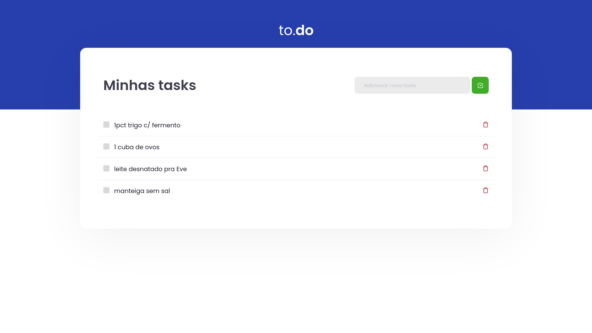
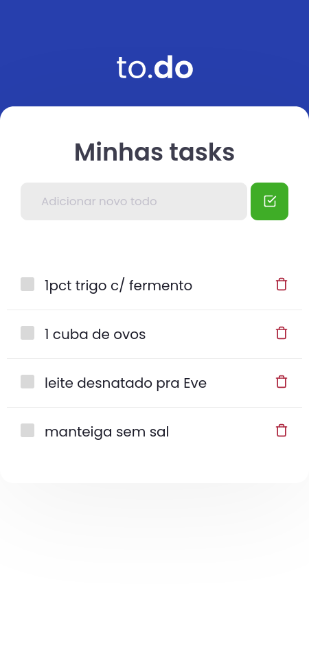

| Desktop                         | Mobile                        |
| :------------------------------ | :---------------------------- |
|  |  |

# Módulo 01 - Desafio 01

Este repositório contem a resolução do primeiro desafio da trilha de ReactJS do curso Ignite.

O template veio com tudo pronto e meus objetivos foram criar a lógica por tŕas das funcionalizades.

As tarefas eram:
* Ser possível adicionar uma tarefa à lista;
* Impedir de adicionar tarefa se o campo de texto estiver vazio;
* Ser possível marcar uma tarefa como concluída;
* Ser possível deletar uma tarefa.

Além disso, tomei liberdade para fazer algumas mudanças.
No desafio era necessário criar um ID para cada item da lista. Para isso, em
vez de ***apenas*** criar números aleatórios com `Math.random()`, criei uma pequena
função de criação de IDs aleatórios ao estilo md5 utilizando o caracteres A-Z,
a-z e 0-9.

## Iniciando a aplicação:

\>\> [Acesse online](https://mvitor.dev/ignite-reactjs-chap01-desafio01/) ou:

Com Yarn:

```
$ yarn dev
```

Com NPM:

```
$ npm run dev
```
